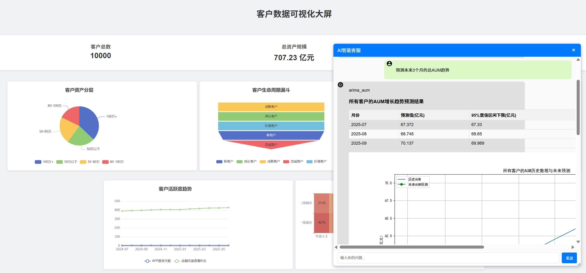
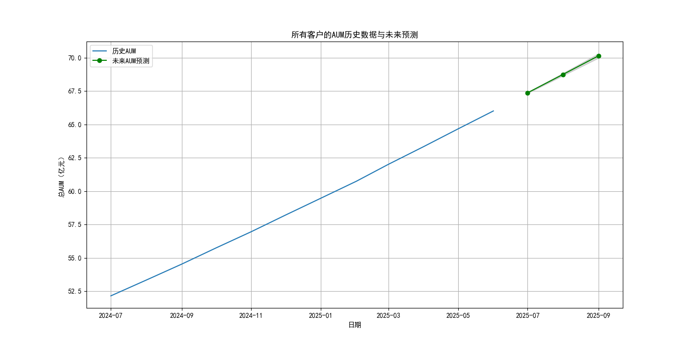
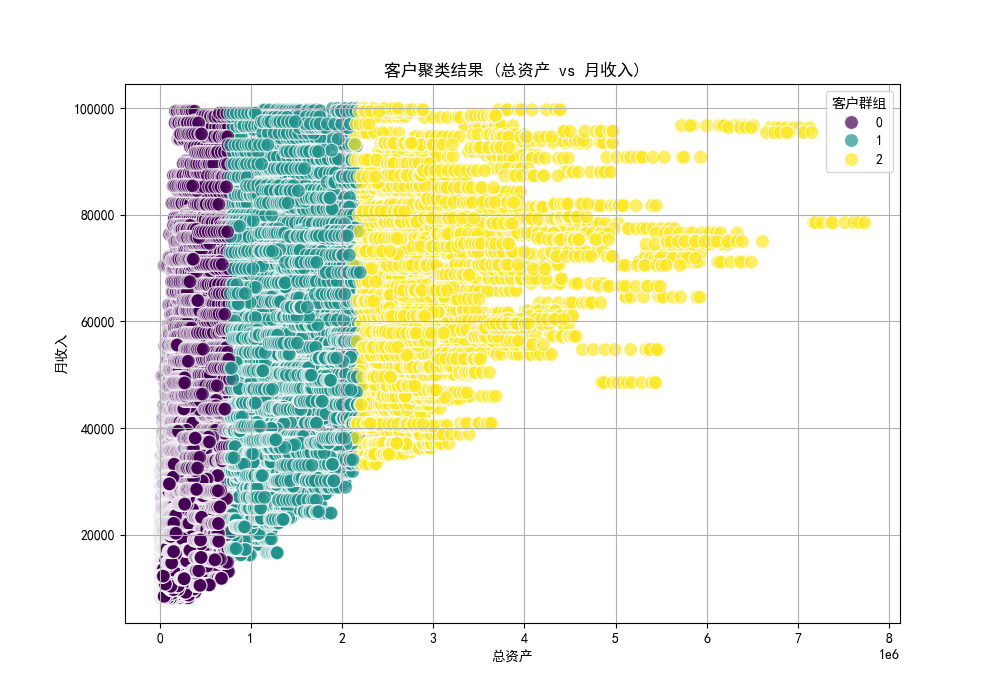
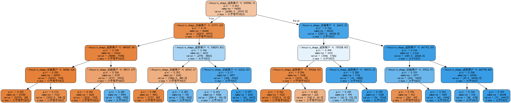
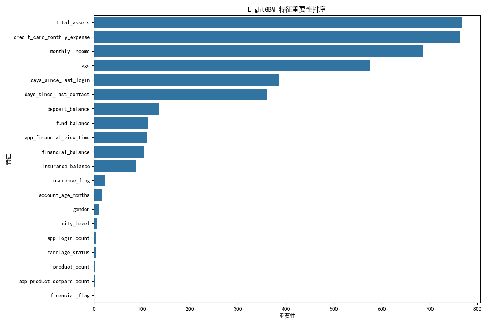

# 百万客群运营助手

## 项目简介

本项目旨在通过数据驱动的精准营销，提升百万级客户的转化率，同时降低营销成本和客户流失率。核心任务包括深入的客户分层分析、构建高精度的预测模型以及制定精细化的分群营销策略，最终优化线上线下的客户触达方式。

## 核心功能

1.  **数据分析与可视化**：
    *   可视化客户资产分层。
    *   描绘高潜力客户画像。
    *   分析客户行为与资产之间的相关性。
    *   提供客户总数、总资产规模、平均资产等基础统计信息。
    *   展示客户生命周期漏斗图。
    *   生成高潜力客户雷达图。
    *   提供营销效果热力图。
    *   展示客户活跃度趋势图。

2.  **智能建模与预测**：
    *   **ARIMA AUM 预测**：使用ARIMA模型预测客户AUM（管理资产规模）的增长趋势，支持单个客户或所有客户的总AUM预测，并提供预测结果和图表。
    *   **决策树客户资产增长预测**：利用决策树模型识别未来3个月内资产容易提升至100万+的客户群体，并返回决策树规则及可视化图。
    *   **SQL查询与可视化**：支持执行SQL语句进行数据查询，并自动对查询结果进行可视化。

3.  **精准营销策略**：
    *   动态更新高潜力客户名单。
    *   结合APP弹窗、电话外呼等多种渠道进行精准触达。
    *   建立转化率监控与预警机制。

## 技术栈

*   **后端框架**：Flask
*   **数据处理**：Pandas
*   **数据库连接**：SQLAlchemy (MySQL)
*   **机器学习模型**：
    *   ARIMA (statsmodels)
    *   决策树 (scikit-learn)
*   **可视化**：Matplotlib, ECharts (通过Flask提供数据接口)
*   **智能体框架**：Qwen-Agent

## 安装与运行

1.  **克隆项目**：
    ```bash
    git clone <项目仓库地址>
    cd customer_chat_assistant
    ```

2.  **安装依赖**：
    ```bash
    pip install -r requirements.txt
    ```
    （请确保 `requirements.txt` 文件包含所有必要的库，例如 `flask`, `pandas`, `sqlalchemy`, `mysql-connector-python`, `statsmodels`, `scikit-learn`, `qwen-agent`, `matplotlib`, `graphviz` 等）

3.  **配置数据库**：
    *   修改 `customer_operation_assistant.py` 中 `ExcSQLTool` 类的数据库连接字符串，替换为您的MySQL数据库信息。
    *   确保数据库中存在 `customer_base` 和 `customer_behavior_assets` 表，并导入相应的 `customer_base.csv` 和 `customer_behavior_assets.csv` 数据文件。

4.  **配置DashScope API Key**：
    *   在 `customer_operation_assistant.py` 中设置 `dashscope_api_key = "sk-xxxxx"` 为您的实际API Key。

5.  **运行应用**：
    ```bash
    python app.py
    ```

6.  **访问应用**：
    在浏览器中打开 `http://127.0.0.1:5000/` 即可访问客户运营助手仪表盘。
    

7. **其它图表**
    
    
    
    

## 项目结构

```
. # 项目根目录
├── app.py                      # Flask Web 应用主文件，负责仪表盘数据接口和聊天接口
├── customer_operation_assistant.py # 核心智能体逻辑和工具定义（SQL查询、ARIMA预测、决策树）
├── chart_generator.py          # 生成图表
├── images/                     # 存放项目相关图片
│   └── dashboard.png           # 仪表盘截图示例
├── static/                     # 静态文件目录（CSS, JS, 生成的图表图片）
│   ├── aum_forecast_*.png      # AUM预测图
│   ├── clusters.png            # 聚类图（如果存在）
│   ├── dt.png                  # 决策树图（如果存在）
│   ├── echarts.min.js          # ECharts JavaScript库
│   └── lgbm.png                # LightGBM图（如果存在）
├── templates/                  # HTML模板文件
│   └── index.html              # 仪表盘主页面
├── customer_base.csv           # 示例客户基础数据
└── customer_behavior_assets.csv # 示例客户行为资产数据
```

## 使用说明

*   访问Web界面查看客户运营仪表盘。
*   通过聊天界面与智能助手交互，提问关于客户数据的问题，或请求进行AUM预测、客户分群等操作。

## 贡献

欢迎任何形式的贡献！如果您有任何建议或发现Bug，请提交Issue或Pull Request。